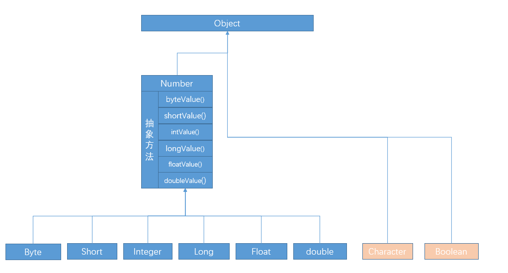

## 包装类
> 背景：java是面向对象程序语言，但并非'完全面向对象'，基本数据类型就不是对象，但开发中经常涉及到基本数据类型的操作，转换为对象后，调用属性方法更容易解决问题

### 包装类的对应关系 && 继承关系
> 1. 对应关系
```java
/*
  基本数据类型     包装类
    byte           Byte
    short          Short
    int            Integer
    long           Long
    float          Float
    double         Double
    char           Character
    boolean        Boolean
*/
```

> 2. 继承关系
> Byte、Short、Integer、Long、Float、Double -> Number类 -> Object类
> Character、Boolean -> Object类
> -> 包装类、Number类存在于java.lang包，使用时无需导包



### 应用场景
> 基本数据类型与包装类对象、字符串的相互转换、集合的操作等

#### 装箱 && 拆箱 -> 基本数据类型与包装类对象相互转换
```java
// 下述以Integer包装类为例，其它包装类使用方法类似

// 装箱：基本数据类型 -> 包装类
int num = 10;
Integer n = new Integer(num);//java9宣布废弃此写法,也就不允许外界创建对象，仅能通过静态方法valueOf转换 -> 底层实现：构造器使用private修饰，仅能类内部调用，valueOf方法返回值就是new Integer()
Integer n1 = Integer.valueOf(num);

// 拆箱：包装类 -> 基本数据类型
Integer n2 = 100;
int n3 = n2.intValue();

// 自动装箱[autoboxing]、自动拆箱[unboxing] -> 编译器可自动完成转换,JDK1.5之后出现
Integer n4 = 10//编译器默认Integer n4 = Integer.valueOf(10) -> 自动装箱
int n5 = new Integer(100);//编译器默认转换 int n5 = new Integer(100).intValue() -> 自动拆箱

// 自动拆箱空指针异常问题 -> 编译时不报错，运行时报错java.lang.NullPointerException
Integer n6 = null;
int n7 = n6;//自动拆箱默认调用n6.intValue(),但是n6为null,所以空指针异常
```

### 基本数据类型与字符串间的转换
```java
// 字符串转换成对象
Integer n = Integer.parseInt("520");//Integer n = 520;
Integer n1 = new Integer("618");//Integer n1 = 618;Integer类提供的构造器重载方法 -> java9宣布废弃

// 对象转换成字符串
String s1 = n.toString();// String s1 = "520" -> 底层使用的new String()

// 补充：获取类相关常量
System.out.println(Integer.MAX_VALUE);//最大值
```

### 包装类的缓存
```java
/*
  包装类的缓存：  
    包装类提供的valueOf方法会对-128~127间的数进行缓存，目的是提高效率 -> 仅仅是整型、char类型的包装类

    public static Integer valueOf(int i) {
      if (i >= IntegerCache.low && i <= IntegerCache.high) {
        return IntegerCache.cache[i + (-IntegerCache.low)];
      }
      return new Integer(i);
    }
*/ 
Integer n5 = 520;
Integer n6 = 520;
System.out.println(n5 == n6);//false
System.out.println(n5.equals(n6));//true
Integer n7 = -128;
Integer n8 = -128;
System.out.println(n7 == n8);//true
System.out.println(n7 == n8);//true
```