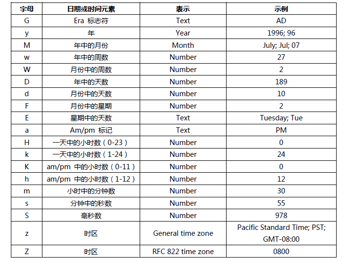

## DateFormat类
> DateFormat是抽象类，SimpleDateFormat子类来具体实现 -> java.text.SimpleDateFormat
> 功能：时间对象与指定格式字符串的相互转化 -> Date类提供的toString()方法仅能转化为指定格式字符串
```java
SimpleDateFormat s1 = new SimpleDateFormat("yyyy-MM-dd hh:mm:ss");
SimpleDateFormat s2 = new SimpleDateFormat("yyyy-MM-dd");

// 时间对象转化为指定格式字符串
String str1 = s1.format(new Date());
String str2 = s2.format(new Date());
System.out.println(str1);//2021-07-10 11:23:53
System.out.println(str2);//2021-07-10

// 指定格式字符串转化为时间对象，字符串格式需要和指定格式一致
String time1 = "2021-08-08 12:12:12";
String time2 = "2021-08-08";
Date date1 = s1.parse(time1);
Date date2 = s2.parse(time1);
System.out.println(date1);//Sun Aug 08 00:12:12 CST 2021
System.out.println(date2);//Sun Aug 08 00:00:00 CST 2021
```

### 格式化字符
