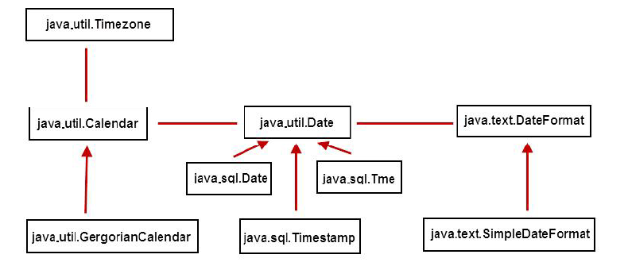

## 时间处理相关类
> Date、DateFormat、Calendar是相对独立的类，并没有继承关系
> 背景：JDK1.1之前仅有Date类，其提供了日期操作、字符串转换成时间对象等方法，但是目前都废弃了;JDK1.1之后提供了字符串转化DateFormat类、日期操作类Calendar


### 时间戳
> 1970年01月01日00:00:00定为基准时间，所有时间到基准时间的毫秒数称为时间戳
```java
// 开发中使用long类型定义变量，其数据范围可表示基准时间往前几亿年、往后几亿年
long range = Long.MAX_VALUE/(1000L*3600*24*365);//292471208 -> 2.9亿年

// 时间戳
long now = System.currentTimeMillis();//当前时间到基准时间的毫秒数 -> 当前时间指的是操作系统时间，可手动更改
```