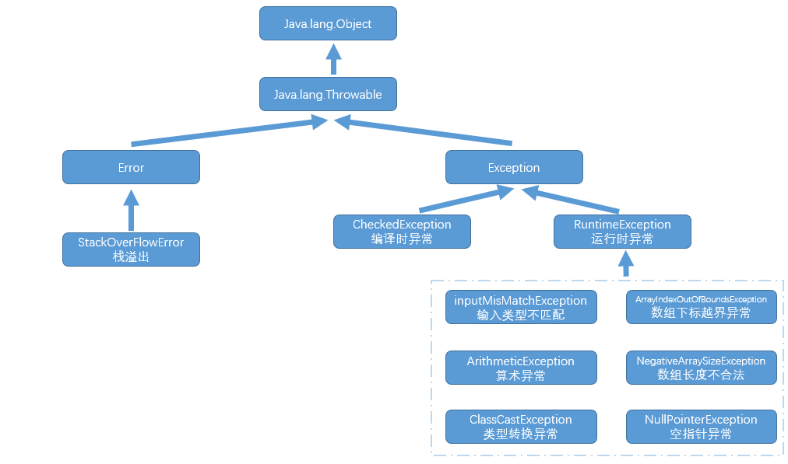
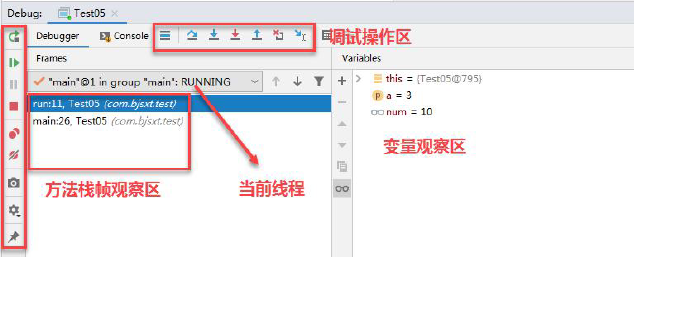
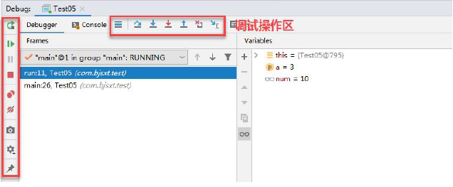
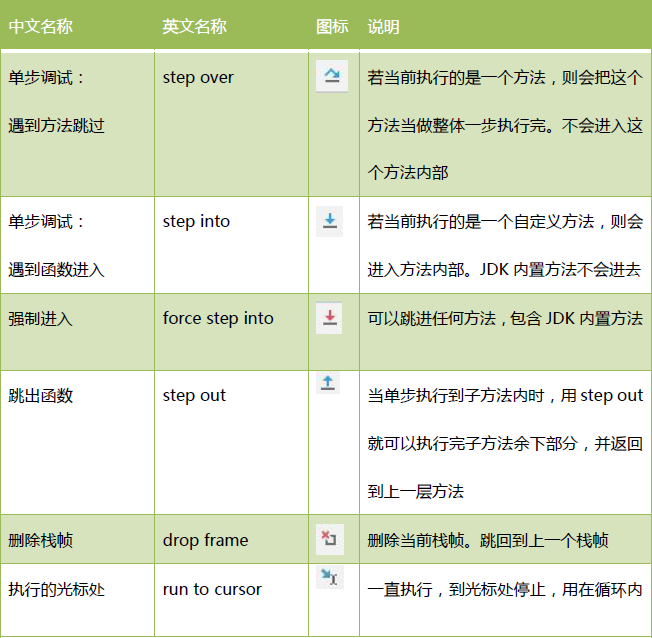
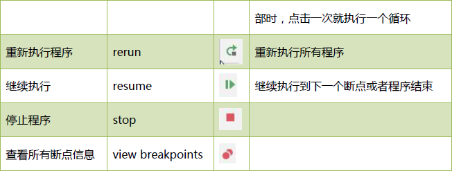

## 异常
> 背景：开发中[编译/执行]必然会遇到异常情况，例如涉及到IO模块用户输入不规范、打开某文件，文件不存在或格式不正确等等，开发者需要花费大量时间处理异常，而且业务代码中会耦合很多处理异常的代码，最终导致开发变的异常艰难 => 程序语言对异常进行了重新定义，程序可以合理处理异常并继续执行代码，避免程序崩溃
> JAVA使用面向对象的方式处理异常，提供了很多处理异常的类，类中定义异常的信息和对异常进行处理的方法

### 异常分类
> java异常类Throwable派生了两个子类：Error、Exception


#### Error类
> 其表示程序无法处理的错误，往往都是涉及到操作系统资源层面的问题，直接造成中断 -> 代码运行时java虚拟机[JVM]出现问题，运行错误Virtual MachineError,JVM会选择线程终止 => 实际Error表示系统JVM处于不可恢复的崩溃状态

#### Exception类
> 需要程序处理的异常，分为编译时异常、运行时异常 
> 1.编译时异常[CheckedException 未检查异常]
> IOException、SQLException等以及用户自定义异常，此类异常编译时必须处理，否则无法通过编译

> 2.运行时异常[RuntimeException 已检查异常]
> 显示的声明或捕获对程序可读性和运行效率影响较大，开发中往往在代理逻辑层进行处理，避免发生异常
```java
// ArithmeticException异常 -> 被除数为0
if(a != 0) { System.out.println(1/a) }

// ArrayIndexOutOfBoundsException异常 -> 数组越界异常
int[] arr = new int[5];
int b = 5;
if (b < arr.length) { System.out.println(arr[b]) };

// NumberFormatException异常
String str = "1234abc";
System.out.println(Integer.parseInt(str));
// 解决：若是数字才进行转换，正则判断
Pattern p = Pattern.compile("^\\d+$");
Matcher m = p.matcher(str);
if (m.matches()) { System.out.println(Integer.parseInt(str))}

// NullPointerException异常 -> 空指针
String str1 = null;
if(str1 != null) { System.out.println(str1.charAt(0)) };

// ClassCastException异常
Animal a = new Dog();
if(a instanceof Cat) {
  Cat c = (Cat)a;
}
```

### 异常处理

#### 声明异常
> CheckedException异常产生时不一定立刻处理它，可以把异常throws出去 -> 实际就是当前方法并不需要处理发生的异常或者不确定如何处理这种异常，向上传递给调用它的方法处理
```java
// 方法的首部声明该方法可能抛出的异常，若抛出多个已检查异常，以逗号隔开
public static void readFile(String name) throws FileNotFoundException,IOException {}

// 方法重写时声明异常原则：若父类方法有声明异常，那么子类声明的异常范围不能超过父类声明的范围
```

#### 捕获异常
> 开发者可通过程序对异常进行处理，控制程序流
```java
/*
  1.try语句必须带有至少一个catch或一个finally语句块 -> catch语句可有多条，finally语句仅有一条，可选
  2.执行过程：try中某语句发生异常时，该语句后续的语句就不执行了，此时会跳到catch中执行异常相关代码，然后继续执行finally中的代码
  3.catch中异常对象具备的方法：
    toString();//异常的类名及产生异常的原因
    getMessage();//仅显示异常原因，但不显示类名
    printStackTrace();//跟踪异常事件发生时堆栈的内容
    -> catch中捕获异常类时，若异常类间有继承关系，越是顶层的类越放在下面，因为其会先捕获子类异常再捕获父类异常
  4.finally语句：常用于关闭程序快已打开的资源，例如：关闭文件流、释放数据库连接

  -> 即使try、catch快中存在return语句，finally语句也会执行，执行完finally语句后再通过return退出 -> 仅有一种情况finally语句不会执行，执行finally语句前遇到了System.exit(0)结束程序运行

  try{

  } catch() {

  } catch() {

  } finally {

  }
*/
```

### 自定义异常
> 背景：JDK提供的异常类都无法满足需求，可自定义异常
> 若自定义异常类继承Exception类，则默认为CheckedException，若想继承运行时异常，需要显示继承RuntimeException类
```java
/**
 * 自定义异常：大多包含两个构造器，默认、带参
 */
class IllegalAgeException extends Exception {
  // 默认构造器
  public IllegalAgeException() {}

  // 带参构造器
  public IllegalAgeException(String message) {
    super(message);
  }
}
class Person {
  private String name;
  private int age;
  public void setName(String name) {
    this.name = name;
  }
  public void setAge(int age) throws IllegalAgeException {
    if (age < 0) {
      throw new IllegalAgeException("人的年龄不应该为负数");
    }
    this.age = age;
  }
  public String toString() {
    return "name is " + name + " and age is " + age;
  }
}

public class Demo {
  public static void main(String[] args) {
    Person p = new Person();
    try {
      p.setName("Lincoln");
      p.setAge(-1);
    } catch (IllegalAgeException e) {
      e.printStackTrace();
    }
    System.out.println(p);
  }
}
```

### Bug调试 -> IDEA



