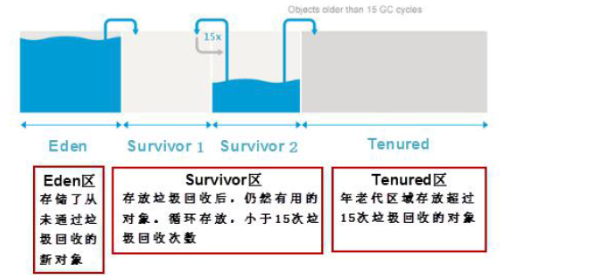

## 垃圾回收 -> Garbage Collection
> 背景：内存分为栈区[存放变量、函数栈帧，系统调用]、堆区[存放对象，开发者new/delete操作]、方法区[存放常量、静态内容、类加载器，本质也是堆区] -> java内存管理指的就是堆区管理，因为堆区开放给开发者操作，C、C++开发者进行内存分配、回收，常会造成内存泄漏等问题，java可自动进行内存分配、回收，有效避免了内存泄漏，开发者更聚焦在业务开发而不是内存管理[内存管理还是应该语言层面抹平，但C、C++偏系统编程语言，确实需要进行内存管理]
> 本质：发现垃圾 -> 回收垃圾 => 发现无用对象 -> 回收无用对象[对象赋值Null即可]

### 垃圾回收过程 -> 分代垃圾回收机制
> 对象的生命周期不同，将对象分为三种状态年轻代、年老代、永久代，处于不同状态的对象存放堆中不同区域，JVM将堆内存划分为Eden、Survivor、Tenured/Old

> 流程：
> 1. 首先所有新生成对象都存放在Eden区，当Eden区存放满时，Minor GC会进行清理，然后依然存活的对象会放入到Survivor区s1区[分为s1/s2区域]，当Eden区又满了的时候，Minor GC再次进行清理，然后将Eden区、s1存活的，放入到s2区，此时Eden、s1被清空了，当Eden区再次被占满时，Minor GC再次进行清理，然后将Eden区、s2区存活的放入s1区，此时Eden、s2被清空，循环操作[这种频繁的复制操作会浪费内存空间]，当操作N[默认15次]Minor GC垃圾回收后仍然存活的对象会被放入到年老代Tenured区，显然此区存放的都是生命周期较长的对象，当年老代对象占满时候，此时就需要启动Major GC进行垃圾回收，Full GC可进行大扫除全量回收年轻代、年老代区域
> 2. 永久代：存放常量、静态内容、类加载等，实际就是方法区 -> 垃圾回收不会对其进行清理，因为其会一直占用内存，但时间很久时也会被Full GC清理 => JDK8之前使用'永久代'的堆内存划分方式，JDK8之后取消了'永久代'，使用metaspace元数据空间来代替，也就是方法区的内容全部存放在硬盘
> 

> 分类：
> Minor GC: 清理年轻代区域Eden、Survivor 
> Major GC: 清理年老代区域Tenured
> Full GC:  全量清理年轻代、年老代区域 -> 成本较高，影响系统性能

### 垃圾回收算法
> 1. 引用计数法
> 堆中每个对象都对应一个'引用计数器'，当有引用指向该对象时引用计数器加1，当指向该对象的引用失效时[赋值为null]引用计数器减1，若最后该对象引用计数器值为0，java回收器会认为该对象为'无用对象'并对其进行回收 -> 优点：算法简单；缺点：循环引用的无用对象无法被回收
```java
// 循环引用
public class Student {
  String name;
  Student friend;
  public static void main(String[] args) {
    Student s1 = new Student();
    Student s2 = new Student();
    // s1/s2s虽然赋值为null，但却循环引用导致无法被回收
    s1.friend = s2;
    s2.friend = s1;
    s1 = null;
    s2 = null;
  }
}
```
> 2. 引用可达法/根搜索算法
> 将引用关系看作'图关系'，从根节点开始寻找对应的引用节点，找到后继续寻找该节点的引用节点，当所有引用节点寻找完毕后，剩余的节点则被认为是没有被引用到的节点，即无用节点

### JVM调优
> JVM调优很大部分是对Full GC的调节
> 引起Full GC的操作：
> 1. 年老代Tenured被写满
> 2. 永久代Perm被写满
> 3. System.gc()被显示调用
> 4. 上次GC后Heap的各域分配策略动态变化

> 开发者无权调用垃圾回收器，仅能JVM自行调用
> 1. 开发者使用System.gc()也仅仅是通知JVM，并不是运行垃圾回收器，是否运行依旧是JVM自行判断 -> 尽量少用影响系统性能
> 2. finalize方法：可用于释放对象或资源 -> 不建议使用

### 开发中容易造成内存泄漏的操作 -> 很容易造成系统崩溃
> 本质：java垃圾回收可回收掉'垃圾对象'，但如果有些对象一直被引用，不被视为垃圾，有很多这种对象的时候就会造成'内存泄漏'，因此并非有java垃圾回收后就没有'内存泄漏'发生
> 1. 创建大量无用对象
```java
// 拼接字符串时使用了String 而不是StringBuilder
String str = "";
for (int i = 0; i < 10000; i++) {
  str += i; //相当于产生了10000 个String 对象
}
```
> 2. 静态集合类的使用
> HashMap、Vector、List等的使用很容易出现内存泄露，这些静态变量的生命周期和应用程序一致，所有的对象Object也不能被释放
> 3. 各种连接对象未关闭
> IO流对象、数据库连接对象、网络连接对象等连接对象属于物理连接，它们和硬盘或者网络连接，不使用的时候一定要关闭
> 4. 监听器的使用不当
> 释放对象时，没有删除相应的监听器