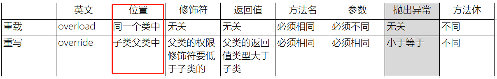

## 方法

### 方法重载
> 背景：某些方法的参数支持很多种不同数据类型，代码层面不好实现 -> 解决方案：1.定义完全不同的方法[方法名、参数都不同]; 2.方法名相同，参数不同，也就是方法重载，实际java是强类型语言，但它没有提供'可以兼容所有数据类型的类型'，例如TypeScript提供了any类型便可以解决此类问题，但也不建议使用，因为强类型语言的类型约束就失去了意义 => java提供的方法重载也是较好的解决方案

> 方法重载要求：-> 方法形式：访问/权限修饰符 [特征修饰符] 返回值类型 方法名(参数列表) [抛出异常] [{方法体}]
> 1. 方法名必须相同、参数[个数、类型、顺序]必须不同
> 2. 无需关心修饰符、返回值、抛出异常
```java
public class Person() {
  @overload
  public void deal(int num) {

  }

  public void deal(boolean bool) {

  }

  public void deal(String str) {

  }

  // 类的重载
  public void deal(Cat cat) {};
  public void deal(Dog dog) {};
}
```

### 方法重写
> 背景：父类提供的方法无法满足子类需求，子类可对方法进行重写
> 方法重写要求：-> 方法形式：访问/权限修饰符 [特征修饰符] 返回值类型 方法名(参数列表) [抛出异常] [{方法体}]
> 1. 方法名、参数[个数、类型、顺序]必须相同
> 2. 修饰符：父类权限修饰符要低于子类
> 3. 返回值：父类返回值类型大于子类
> 4. 抛出异常：父类小于等于子类
```java
public class Animal{
  public void shout() {
    System.out.println("shout");
  }
}

public class Cat extends Animal{
  @override
  public void shout() {
    System.out.println("shout-喵喵");
  }
}
```

#### 方法重载 VS 方法重写



### 可变参数
> 解决类型确定、个数不确定的参数情况，java会将参数全部塞进一个数组中 -> 方法重载聚焦解决类型、个数都不确定的情况
> 1.参数个数可以是0个、多个、或者直接传入数组，其最终转换格式就是数组[传入数组就直接使用，其它的塞进数组]
> 2.可变参数必须作为最后一个参数
```java
public class Test {
  public void deal(int a, Object b, String....params) {
    for(String s: params) {
      System.out.println(s)
    }
  }
}
```