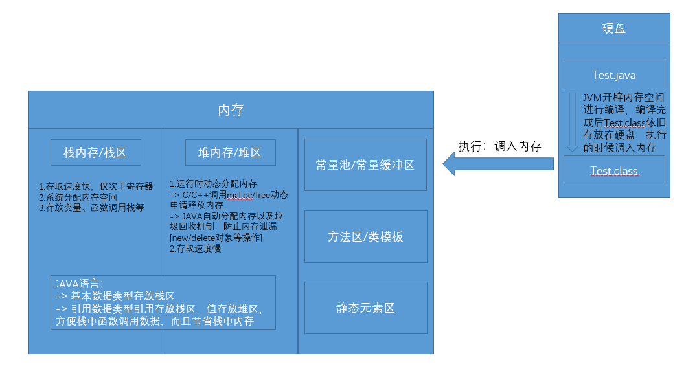

## 变量常量

### 变量
> 开辟内存空间，程序执行过程中可改变值，基本数据类型存放栈区，引用数据类型引用存放栈区，内容存放堆区

> 声明 && 赋值 && 定义
> 1. 声明：数据类型 变量名 -> 必须书写数据类型
> 2. 赋值：变量名 = 值
> 3. 定义/初始化：数据类型 变量名 = 值

> 分类：
> 全局变量：声明、赋值可以分开，仅声明会有默认值[整型类0、浮点型0.0、布尔型false、char型就是空(什么都没有)、引用类型null] -> 栈存储
> 局部变量(函数内)：仅能直接定义/初始化，仅声明会报错'尚未初始化变量' -> 栈中存储
> 成员变量(类内变量非方法)：声明、赋值可以分开，仅声明会有默认值 -> 堆中存储
```java
   int max = 0; 
   int min = 0;
   // 简写
   int max,min;
   int max = 0, min = 0;
```

> 变量名命名规定：-> 本质就是标识符，类名、变量名、函数名都遵循该规定
> 1. 其由数字、字母、下划线、$符号构成，首位不能为数字，中文也不推荐，严格区分大小写
> 2. 命名规约 -> 开发人员约定俗成，非强制规定，不按照该规约也OK，不遵循规定会报错，不遵循规约只会对其它开发人员不友好而已，不会报错
>    [1].类名：大驼峰  TestDemo
>    [2].变量名/函数名：小驼峰 testDemo

### 常量
> 存放在内存常量池，程序执行过程中不能改变值

> 常量定义
> final 数据类型 常量名 = 值;//声明与赋值不能分开，只能直接定义使用，final关键字可参考'类部分'[那里会详细介绍]

> 常量名命名规定：
> 1. 其由数字、字母、下划线、$符号构成，首位不能为数字，中文也不推荐
> 2. 命名规约
>    [1].某些常量的值往往全都使用大写表示，例如固定的值PI=3.1415926、表示某含义的值UP/DOWN/LEFT/RIGHT表示上下左右

> 常量分类：
> 字面常量：1、3.4、'a'、true/false、字符串'abc'[其归属于String类，虽然是引用数据类型，但值可视为常量]等
> 符号常量/字符常量：final关键字修饰的变量，常为用户自定义常量

> 字符 vs 字符串
> 字符：char类型2个字节 -> 单引号：'a'、'中',//单引号中不能为空，而且也只能放置一个字符，例如一个中文汉字，放多个就归属为字符串
> 字符串：String类引用类型 -> 双引号："a"、"abc"、""空串、" "空格串、null

### 补充
