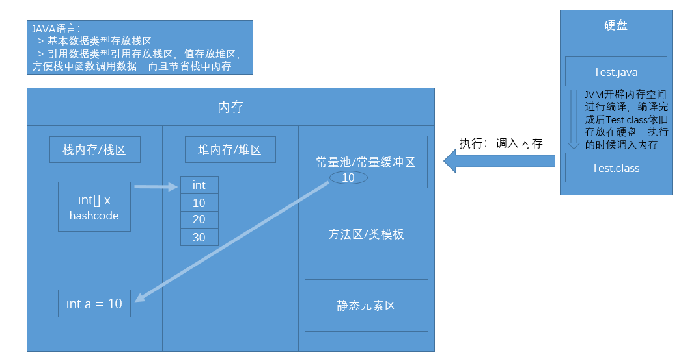

## 一维数组

### 声明 && 赋值 && 定义
> 声明：
> 数据类型[] 数组名 / 数据类型 []数组名 / 数据类型 数组名[] -> 建议使用第一种
> int[] a;
> double[] b;
> char[] c;
> boolean[] d;
> String[] e;

> 赋值：
> int[] a;  
> a = new int[]{1,2,3,4,5,6};

> 定义/初始化：
> 1. 静态初始化：有长度、有元素
> 数据类型[] 数组名 = new 数据类型[]{ele,ele,ele,,,,,}
> 数据类型[] 数组名 = {ele,ele,ele,,,,,}//简写 -> 只有初始化时可以简写，赋值时不可以，因为要明确数据类型(强类型语言)
> 2. 动态初始化：有长度、无元素[默认值]
> 数据类型[] 数组名 = new 数据类型[length]//length不能省略，不要以为默认值为0，编译会报错(数组没有维度)
> 整数默认值：0
> 浮点型默认值：0.0
> 字符型默认值：0 -> char类型
> 布尔型默认值：false
> 引用型默认值：null

### 数据元素的访问/存取 -> 遍历
> 数组索引的取值范围：[0,arr.length-1];//越界异常：ArrayIndexOutOfBoundsException
> 普通for循环
```java
// 可读可写
for(变量; 终止条件; 变化量) {}
```
> 增强for循环 -> JDK1.5出现，后续又出现了更强的封装for循环，例如forEach
```java
// 可读不可写，而且不知道元素是第几个，因为没有index索引
for(变量(接收数组中的元素)：数组) {}
```

### 一维数组的内存图示
