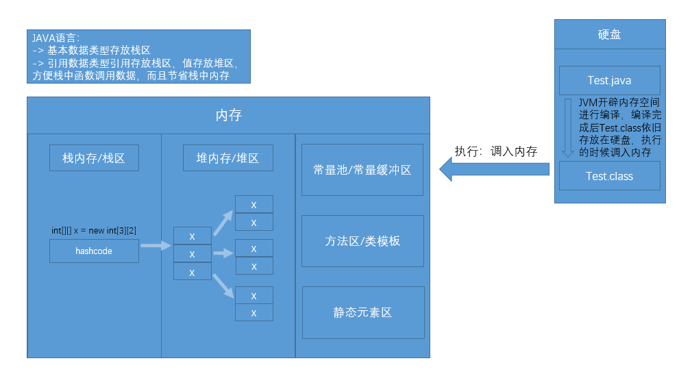

## 多维数组

### 声明 && 赋值 && 定义
> 声明：
> 存储的类型[] 数组名字
> 二维数组：int[][] a;
> 三维数组：int[][][] b;

> 赋值：
> int[][] a;
> a = new int[][]{{1,2},{3,4,5},{6,7}};
> int[][][] b;
> b = new int[][][]{{{1,2},{3,4}},{{5,6},{7,8}}}

> 定义/初始化：
> 1. 静态初始化：有长度、有元素
> 存储的类型[] 数组名字 = new 存储的类型[]{ele,ele,ele,,,,,}
> 存储的类型[] 数组名字 = {ele,ele,ele,,,,,}//简写 -> 只有初始化时可以简写，赋值时不可以，因为要明确数据类型(强类型语言)
> 2. 动态初始化：有长度、无元素[默认值]
> 存储的类型[] 数组名字 = new 数据类型[length][length] -> 最后的数据长度可不写，不会报错(虽然数组规定了必须确定长度)，但不能直接操作，会报错(NullPointerException) => 小结：可以不写为空，但不能为空后还去操作
> 整数默认值：0
> 浮点型默认值：0.0
> 字符型默认值：0 -> char类型
> 布尔型默认值：false
> 引用型默认值：null

### 数据元素的访问/存取 -> 遍历
> 数组索引的取值范围：[0,arr.length-1];//越界异常：ArrayIndexOutOfBoundsException
> 普通for循环
```java
// 可读可写
for(变量; 终止条件; 变化量) {}
```
> 增强for循环 -> JDK1.5出现，后续又出现了更强的封装for循环，例如forEach
```java
// 可读不可写，而且不知道元素是第几个，因为没有index索引
for(变量(接收数组中的元素)：数组) {}
```

### 二维数组的内存图示
> 其是树形结构，不是矩阵
```java
  // int[][] arr = new int[length1][length2];// length1必填，length2非必填，也就是'第二维度'可以相同也可以不同
  int[][] arr = new int[3][];
  arr[0] = new int[3];
  arr[1] = new int[]{1,2};
  arr[2] = new int[4];
```
