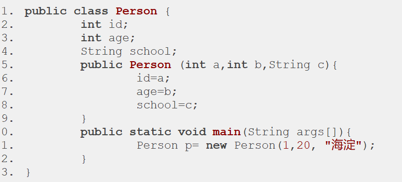

## 初识类

### 类 && 对象
> 类提供模板、对象根据类模板创建实体
> 类是抽象出的概念，对象是具体的实体 -> 抽象向具体的过渡

### 类组成部分
> 属性、方法、构造器、代码块、内部类
```java
// 访问/权限修饰符 class关键字 类名
public class Person {
  // 属性 -> 描述静态
  // 访问/权限修饰符 [特征修饰符] 数据类型 属性名 = [初始值]
  public String name;
  public int age;
  public String sex;


  // 方法 -> 描述动态操作
  // 访问/权限修饰符 [特征修饰符] 返回值类型 方法名(参数列表) [抛出异常] [{方法体}]
  public static void speak() {
    System.out.println("speak");
  } 
  public static void sport() {
    System.out.println("sport");
  }


  // 构造器 -> 背景：最初仅提供属性、方法，创建对象后打点读写操作，或者在类中声明属性的时候直接赋初始值[写死了]，代码阅读性扩展性较差，构造器可以统一管理
  // 默认构造器
  // 访问修饰符 构造器名[必须与类名一致]
  public Person() {
    return this;
  }

  // 构造器的重载 -> 重载后建议将默认构造器也写上，提供更多调用方式，而且显示写了构造器就不会有'隐式调用'，所以想使用隐式构造器必须显示写
  public Person(String name, int age, String sex) {
    this.name = name;
    this.age = age;
    this.sex = sex;
    // return this; //可省略不写，系统会自动添加
  }


  /*
    代码块：
      普通快、构造快、静态快、同步快(多线程)
      执行顺序：
         1.静态快：仅在类加载的时候执行一次，常用于执行全局性的初始化操作，例如创建工厂、数据库的初始化信息等
         2.构造快：开发中很少使用
         3.构造器
         4.普通快
  */
  // 普通快：写在方法中，多用于限制变量作用范围
  public void test() {
    {
      int value = 1;
      System.out.println(value);
    }
    // System.out.println(value);//访问不到值
  }

  // 构造快
  {
    System.out.println("构造快");
  }

  // 静态快：仅能写静态属性、静态方法
  static {
    speak();
  }
}
```

### 对象/实体的创建
```java
/*
  创建对象的过程：
    1.代码执行过程中首次遇到类Person()的时候便会加载类的字节码文件，仅加载一次，然后堆内存中进行对象的初始化，实际就是属性的默认值，本质也就是函数的执行而已，此时也会创建this，this就存储在对象中，然后指向对象本身，实际就是存储对象的地址 -> 创建的对象只有属性没有方法，方法依旧存储在'方法区'，所有对象共用一份
    2.代码执行过程中遇到new Person()中的new关键字，其会在栈中开辟空间执行构造器 -> 构造器的目的就是初始化对象中的值
    3.代码执行过程中遇到Person test = new Person(),其会在栈中开辟空间存储test变量，test变量存储对象的地址，也就是指向该对象 -> 实际就是new Person()返回的this对象赋值给了test
    4.test便可操作对象的属性、方法
*/
Person test = new Person();
Person test1 = new Person("curry",18,"max");
```

### this关键字
```java
/*
  关于this：
    背景：this的出现就是解决'命名冲突',new Person()本质也就是函数执行，Person类中的方法必然是可以访问到类中属性的 -> 为了避免命名冲突因此使用this，没冲突的地方this可省略，有冲突的地方this不可省略
    -> 1.this修饰属性/方法：同一个类中可直接调用，this省略与否取决于'是否冲突' => 开发中不建议this.省略，省略的本质也是编译过程中JVM默认识别为添加'this.'
    -> 2.this修饰构造器：
         同一个类中的构造器可相互使用this调用，但必须放在第一行
         this();//等同于this.Person(); 调用构造器简写
*/
```

### static修饰符
```java
/*
  关于static:
    -> 背景：创建的实体拥有'共同的'属性/方法，每次都需要独立分配内存，于是将公共的属性方法使用static修饰将其存储在'方法区'，所有实体共用即可 => 类加载的时候就会将静态内容加载到方法区中的'静态域'，因此静态内容先于对象存在，被所有对象共享
    -> 优点：共用内存空间，减少内存浪费
    -> 缺点：如果将很多属性方法都使用static修饰，类初始时加载成本较高，内存占用也多[例如：创建少量实体却将很多属性方法都放到方法区，就很不划算]

    使用：
      -> 1.其可修饰：属性、方法、代码块、内部类
      -> 2.访问方式：对象名.属性名/方法名; 类名.属性名/方法名(推荐)
      -> 3.静态方法中仅能访问静态属性 => 因为静态变量/属性是在类加载后便会加载到'方法区静态域',很多时候无需创建对象仅通过类名打点方式调用即可，因此涉及到this，非静态属性/方法的调用会出错(找不到)
      => 类变量：静态属性; 实例变量/非类变量：对象变量
*/
static String school;
public static void record() {}
```

### 类内存图示

