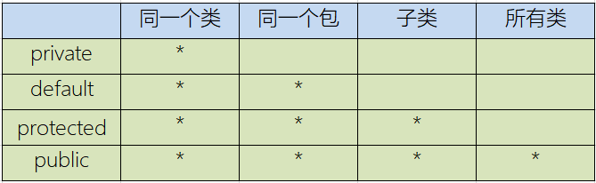
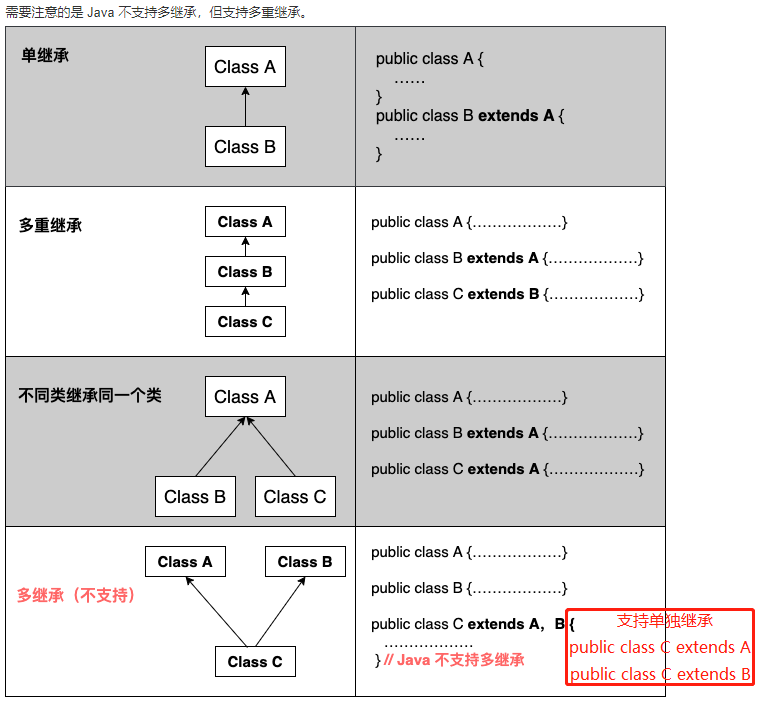
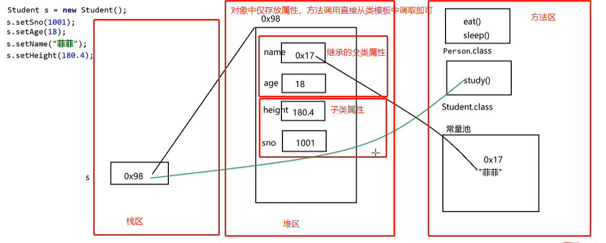

## 继承
> 背景：很多类有相同的属性方法，类模板加载过程中都会占据内存，因此诞生了继承思想，提取公共的属性方法组成'公共类'，其它类继承该类，实现了内存优化
> 父类：超类、基类
> 子类：派生类

> 继承 && 泛化
> 继承：先设计父类，再设计子类
> 泛化：先有子类，再抽象父类

### 对象创建过程 && super关键字
```java
// 父类
public class Animal {
  public String name;
  public int age;

  public void shout() {
    System.out.println("shout")
  }

  public Animal() {};

  public Animal(String name, int age) {
    this.name = name;
    this.age = age;
  }
}

// 子类
public class Cat extends Animal {
  public double weight;
  /*
    super关键字：
      -> 默认过程：子类中调用属性方法，默认先从子类中寻找，子类中找不到便从父类中查找

      1.super.xx
        子类中拥有和父类相同的属性方法，默认会直接调用子类的属性方法，但我们想直接调用父类的属性方法，需要使用super.xx -> [不使用super.的形式，其查找属性方法就是默认查找形式：先子类后父类]
      2.super()
        子类构造器中首行默认为super(); 其会调用父类构造器，可以显示调用进行传参 super(name,age)

      -> 本质：this表示当前对象，super表示父类，this./super.某些情况下可省略不写，开发中建议不要省略
  */
  public void run() {
    super.name;
    super.age;
  }

  public Cat() {};

  public Cat(String name, int age; double weight) {
    super(name,age);
    this.weight = weight;
  }
}

/*
  创建对象过程分析：
    代码执行过程中首次遇到类的时候便会加载该类以及父类，仅加载一次，子类及父类的this都会创建，属性方法挂载到this，后续调用子类构造器的时候，子类构造器中首行代码默认为super()，也就是其也会调用父类构造器，之后子类构造器返回this对象/实体 -> 子类中调用属性方法：如果子类找不到，就从父类中找，沿着继承链寻找

    1.new Cat();//首先会加载Cat类、Cat父类Animal、Animal的父类Object,创建this，属性方法挂载到this，此时均为默认值
    2.new Cat();//其会执行构造器，构造器的首行默认为super()，先调用父类构造器再执行子类构造器，最终构造器返回this对象 -> 此时堆中开辟内存空间
    3.对象创建完成，外界便可操作属性、方法
*/
Cat cat = new Cat("喵喵",3,12);
```

### 权限修饰符
> 背景：继承过程中父子类权限访问需要控制
> public: 整个项目均可访问
> private: 仅当前类中可访问
> protected: 当前类及子类，最大到不同包下的子类
> default: 缺省修饰符[不写时的默认值，不需要写]，最大到同一个包下的不同类
> -> 属性/方法可使用以上四种进行权限修饰，类仅能使用public、default修饰


### 方法重写
> 背景：父类提供的方法无法满足子类需求，子类可对方法进行重写
> 方法重写要求：-> 方法形式：访问/权限修饰符 [特征修饰符] 返回值类型 方法名(参数列表) [抛出异常] [{方法体}]
> 1. 方法名、参数[个数、类型、顺序]必须相同
> 2. 修饰符：父类权限修饰符要低于子类
> 3. 返回值：父类返回值类型大于子类
> 4. 抛出异常：父类小于等于子类
```java
public class Animal{
  public void shout() {
    System.out.println("shout");
  }
}

public class Cat extends Animal{
  @override
  public void shout() {
    System.out.println("shout-喵喵");
  }
}
```

### Object类
> 继承关系：JAVA不支持多继承，每个类仅有一个父类，所有类向上追溯的根基类就是Object类 -> 每个类可以有多个子类，但每个子类仅能拥有一个父类
```java
// 若类声明中未使用extends指明父类，则默认继承Object类
public class Animal /*extends Object*/ {}
```


#### toString方法
> Object类提供的toString方法不太直观，开发中往往进行方法的重写[IDEA提供了快捷键：alt+insert]
```java
/*
Object中的toString():
getClass().getName() + '@' + Integer.toHexString(hashCode());//对象的字符串形式 -> 不好理解，往往都会重写该方法
> getClass().getName();//全限定路径：包名+类名的完整表示
> hashCode();//对象在堆中的地址 -> 哈希算法返回一个码，哈希码
> Integer.toHexString();//将hashCode()传入，返回一个十六进制对应的字符串
*/ 
```

#### equals方法
> Object类提供的equals方法底层使用的依旧是==，开发中往往进行方法的重写，更方便进行引用类型堆内存中的值比较[IDEA提供了快捷键：alt+insert]
> 开发中的比较方法：
> 1. ==: 基本数据类型直接比较值、引用数据类型比较地址
> 2. Object类中的equals方法：基本数据类型直接比较值、引用数据类型比较地址 -> 底层依旧使用==判断
> 3. 重写的equals方法：基本数据类型直接比较值、引用类型中进行堆内存的值比较
```java
// Object中的equals()
class Object {
  public Boolean void equals(obj){
    return this == obj
  }
}
/*
  instanceof运算符：
    a instanceof b: a对象是否是b类的实例，返回值true/false
*/ 
```

### 继承内存图示
