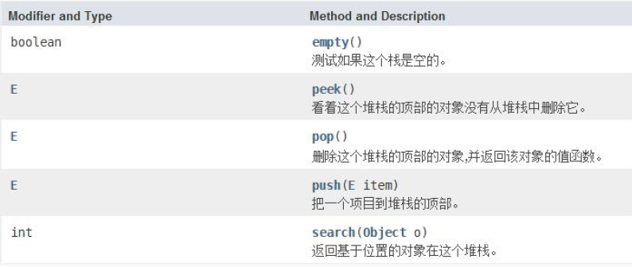

## Vector类 -> List接口的实现类
> 底层基于数组实现：查询效率高、增删效率低 -> 线程安全、效率低[增加了同步检查(synchronized同步标记)]

```java
package com.mi.list;

import java.util.List;
import java.util.Stack;
import java.util.Vector;

public class VectorTest {
  public static void main(String[] args) {
    // Vector类 -> List接口有的方法其都有，此处只例举部分，可参考ArrayList类
    List<String> v = new Vector<>();
    v.add("Hello");
    v.add("World");
    v.add("Hello");

    for(int i=0; i<v.size(); i++) {
        System.out.println(v.get(i));
    }

    for(String str:v) {
        System.out.println(str);
    }
  }
}
```

### Stack类 -> Vector的子类


```java
package com.mi.list;

import java.util.Stack;

public class VectorTest {
  public static void main(String[] args) {
    // Stack类[LIFO后进先出]
    Stack<String> stack = new Stack<>();
    // 入栈
    String a = stack.push("hello");
    System.out.println(a);
    stack.push("java1");
    stack.push("java2");
    // 弹栈
    String res = stack.pop();
    System.out.println(res);
    // 是否为空
    System.out.println(stack.isEmpty());
    // 查看栈顶元素
    String topEle = stack.peek();
    System.out.println(topEle);
    // 查找位置
    int index = stack.search("java2");
    System.out.println(index);
  }
}
```