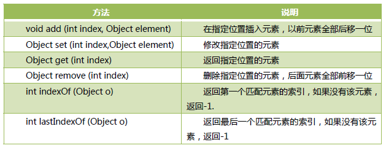

## List接口
> 有序、可重复[满足e1.equals(e2)元素加入容器]

### List接口抽象方法

### List接口实现类
> ArrayList类：基于数组实现，查找效率高，增删效率低，线程不安全
> Vector类：基于数组实现，查找效率高，增删效率低，线程安全
> LinkedList类：基于双向链表实现，查找效率低，增删效率高
> -> 实际都是基于'数据结构'的更高层封装，暴露接口，开发者不用特别深入底层，基于这些类的特点完成'数据容器'的选择即可

> ArrayList类 vs Vector类
> ArrayList类：线程不安全、效率高
> Vector类：线程安全、效率低
> -> 区别主要是'多线程模式下的不同'，多线程的优势是并行处理任务，高效率，但也会引起系列问题，也就是所谓的'线程不安全'[多线程同时读取数据是高效的，若a、b线程同时修改同一个数据，就会出现问题] => 若仅存储数据、数据的读取直接使用ArrayList类; 若同时对某数据进行修改则使用Vector类，其会做同步检查[实际就是添加了synchronized同步标记，本质就是一个锁]，讲多线程并行变为同步执行，因为会根据锁判定'是否执行'，这样做线程是安全的，但效率低[并行->串行]