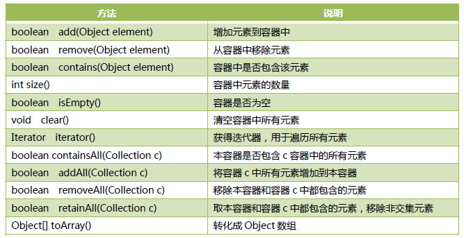

## 单例集合
> 单个数据为单位存储
### Collection接口抽象方法
> JDK1.8


> JDK1.8之后新增抽象方法[助力多线程编程、函数式编程]
```java
/*
  新增方法                                   说明
  removeIf                                  删除容器中所有满足filter指定条件的元素
  stream、parallelStream                    stream、parallelStream分别返回该容器的Stream视图，parallelStream()返回并行的Stream，Stream是Java函数式编程的核心类
  spliterator                               可分割的迭代器，不同以往的iterator需要顺序迭代，Spliterator可以分割为若干个小的迭代器进行并行操作，实现多线程操作提高效率
*/
```