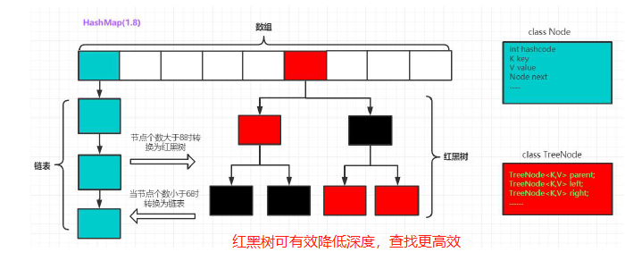

## HashMap类 -> Map接口的实现类
> 基于哈希表实现[实际就是数组+链表]，结合了数组、链表各自优势，查询增删效率都很高


```java
package com.mi.map;

import java.util.Map;
import java.util.HashMap;
import java.util.Set;

public class HashMapTest {
  public static void main(String[] args) {
    Map<String,String> map = new HashMap<>();

    // 新增
    String value = map.put("a","A");
    System.out.println(value);// null -> 当添加相同key值时新值会覆盖旧值，然后会返回旧值，若首次添加会返回null,表示没有旧值
    String value1 = map.put("a","B");
    System.out.println(value1);
    map.put("b","B");
    map.put("c","C");
    map.put("d","D");

    // 获取
    String value2 = map.get("a");
    System.out.println(value2);
    // 获取所有key
    Set<String> keys = map.keySet();
    System.out.println(keys);// [a, b, c, d]
    System.out.println(map);// {a=B, b=B, c=C, d=D}
    for(String key: keys) {
      System.out.println(key);
      System.out.println(map.get(key));
    }

    // 获取key-value
    Set<Map.Entry<String,String>> entrySet = map.entrySet();
    for(Map.Entry<String,String> entry: entrySet) {
      System.out.println(entry.getKey() + "=" + entry.getValue());
    }

    // 并集 -> 若两个集合中有相同key值，并进来的集合会覆盖现集合
    Map<String,String> map1 = new HashMap<>();
    map1.put("a","aaa");
    map1.putAll(map);
    System.out.println(map1);

    // 删除
    String value3 = map.remove("c");
    System.out.println(value3);
    System.out.println(map);

    // 判断key、value
    boolean isKeyExist = map.containsKey("a");
    boolean isValueExist = map.containsValue("D");
    System.out.println(isKeyExist);
    System.out.println(isValueExist);
  }
}

```