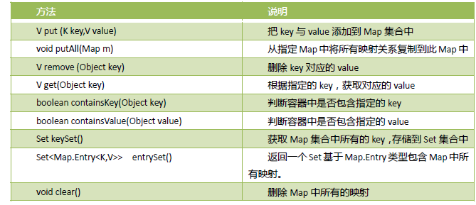

## Map接口 -> 其与Collection接口无关，双例集合接口
> 无序、不可重复[key不能重复，注入相同的key，新value会替换旧value]

### Map接口实现类
> HashMap类：基于哈希表实现[实际就是数组+链表]，结合了数组、链表各自优势，查询增删效率都很高
> TreeMap类：基于哈希表实现[实际就是数组+链表]，但可对容器内元素排序，查询增删效率低于HashMap类 -> 基于排序规则进行排序 
> HashTable类：较少使用
> LinkedHashMap类：较少使用
> Properties类：较少使用