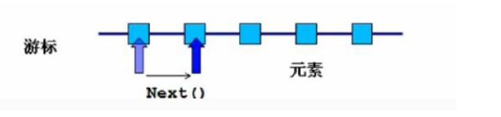

## Iterator迭代器
> 适合迭代处理'容器'元素，某些情况下for/foreach处理容器元素代码较繁琐，不易维护

### 迭代器接口
> Collection接口继承了Iterable接口,该接口包含Iterator抽象方法，因此Collection接口的实现类都实现了该方法 -> 该方法的返回值是迭代器对象，具备如下三个方法：
> boolean hasNext();// 判断游标当前位置是否有元素
> Object next();// 获取当前游标所在位置元素，并将游标移动到下一位置
> void remove();// 删除游标当前位置元素


```java
// 迭代List接口容器
package com.mi.other;

import java.util.List;
import java.util.ArrayList;
import java.util.Iterator;

public class IteratorListTest {
  public static void main(String[] args) {
    List<String> list = new ArrayList<>();
    // 新增
    list.add("a");
    list.add("b");
    list.add("c");

    // 迭代器对象
    Iterator<String> iterator = list.iterator();
    // 迭代方式1
    while(iterator.hasNext()) {
        String value = iterator.next();
        System.out.println(value);
    }
    // 迭代方式2
    for(Iterator<String> it = list.iterator(); it.hasNext();) {
        String value = it.next();
        System.out.println(value);
    }

    // 删除
    while(iterator.hasNext()) {
        String value = iterator.next();
        if("b".equals(value)) {
            iterator.remove();
            System.out.println(value);
        }
    }
  }
}

// 迭代Set接口容器
package com.mi.other;

import java.util.Set;
import java.util.HashSet;
import java.util.Iterator;

public class IteratorSetTest {
  public static void main(String[] args) {
    Set<String> set= new HashSet<>();
    // 新增
    set.add("a");
    set.add("b");
    set.add("c");

    // 迭代器对象
    Iterator<String> iterator = set.iterator();
    // 迭代方式1
    while(iterator.hasNext()) {
      String value = iterator.next();
      System.out.println(value);
    }
    // 迭代方式2
    for(Iterator<String> it = set.iterator(); it.hasNext();) {
      String value = it.next();
      System.out.println(value);
    }
  }
}
```

### java数据迭代方式
> for循环：有很确定的圈数，可读可写
> forEach循环：遍历完所有元素，可读不可写
> iterator迭代器：适合迭代处理'容器'元素，某些情况下for/foreach处理容器元素代码较繁琐，不易维护