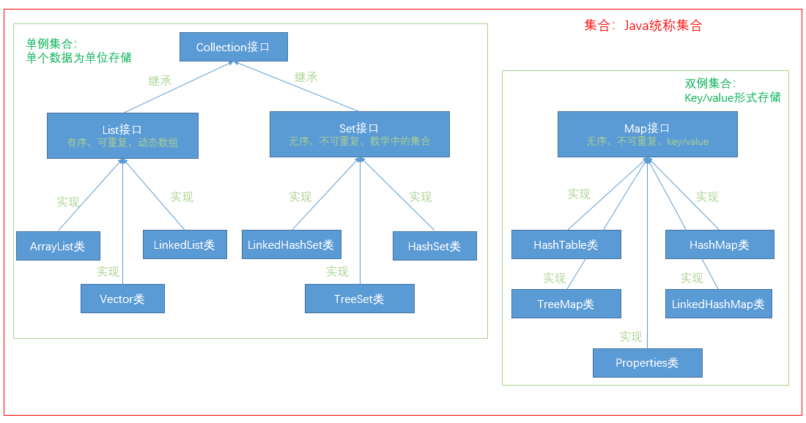

## 容器/集合/collection -> JAVA统称为集合，实际严格来说set是集合，map是字典，几乎所有程序语言都会提供'数组、集合、字典'数据类型完成对'数据结构'的封装接口调用，本质就是自定义数据容器[最好屏蔽掉底层数据结构，仅通过接口调用]
> 背景：数组、对象并不能做到在所有情况下都高效'管理和组织数据' -> JAVA提供了容器管理数据，本质就是基于'数据结构'封装，提供了多种数据封装接口，以满足不同需求使用
> 集合的使用都应该加上泛型表示约束[不加就是默认值]
