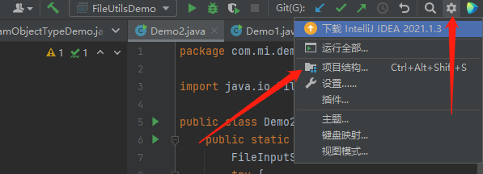
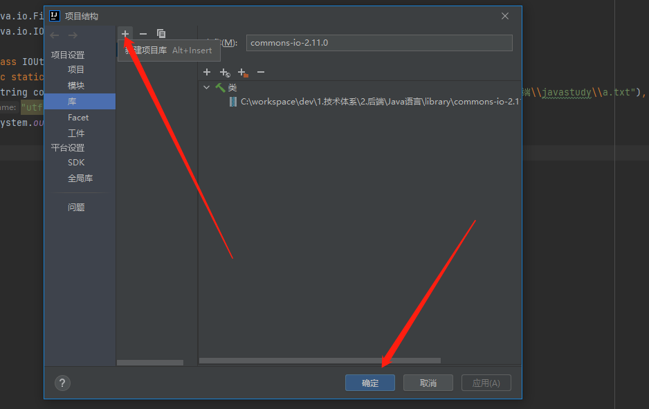

## ApacheIO包
> 背景：JDK中提供的类虽然满足开发需求，但需要大量重复的编程工作，例如遍历目录文件时，需要写大量递归代码，很繁琐 -> Apache组织提供了IO包[commons工具包,主要是IOUtils/FileUtils类]，提供了更加便捷、强大的文件操作，实际就是更高级的'封装接口'

> Apache基金会 -> ASF[Apache Software Foundation] 
> 其是支持开源软件项目的非盈利性组织，在其所支持的Apache项目与子项目中都遵循Apache许可证(Apache License)，实际就是为开源组织提供些资金帮助，得以让这种开源项目持续运转，助力软件领域快速发展，很多著名的开源项目都来源于该组织(不仅仅是java项目)，commons、kafka、maven、shiro、struts、hadoop、hbase、spark等
> https://apache.org/


### commons工具包
> 使用：
> 1.下载jar包：https://commons.apache.org/proper/commons-io/download_io.cgi
> 2.添加到项目中：


> 3.直接使用包中的类即可

#### FileUtils类
> cleanDirectory：清空目录，但不删除目录
> contentEquals：比较两个文件的内容是否相同
> copyDirectory：将一个目录内容拷贝到另一个目录，可以通过FileFilter过滤需要拷贝的文件
> copyFile：将一个文件拷贝到一个新的地址
> copyFileToDirectory：将一个文件拷贝到某个目录下
> copyInputStreamToFile：将一个输入流中的内容拷贝到某个文件
> deleteDirectory：删除目录
> deleteQuietly：删除文件
> listFiles：列出指定目录下的所有文件
> openInputSteam：打开指定文件的输入流
> readFileToString：将文件内容作为字符串返回
> readLines：将文件内容按行返回到一个字符串数组中
> size：返回文件或目录的大小
> write：将字符串内容直接写到文件中
> writeByteArrayToFile:将字节数组内容写到文件中
> writeLines：将容器中的元素的toString 方法返回的内容依次写入文件中
> writeStringToFile：将字符串内容写到文件中
```java
package com.mi.apacheio;

import org.apache.commons.io.FileUtils;
import java.io.File;
import java.io.FileFilter;
import java.io.IOException;

public class FileUtilsDemo {
  public static void main(String[] args) throws IOException {
    System.out.println(new File("C:\\workspace\\dev\\1.技术体系\\2.后端\\javastudy\\a.txt"));
    String content = FileUtils.readFileToString(new File("C:\\workspace\\dev\\1.技术体系\\2.后端\\javastudy\\a.txt"),"utf-8");
    System.out.println(content);

    // 拷贝文件
    FileUtils.copyDirectory(new File("d/a"), new File("d/b"), new FileFilter() {
      // 文件拷贝时的过滤条件 -> 接口内部类
      @Override
      public boolean accept(File pathname) {
        if(pathname.isDirectory() || pathname.getName().endsWith("html")){
          return true;
        }
        return false;
      }
    });
  }
}
```

#### IOUtils类
> buffer：将传入的流进行包装，变成缓冲流，并可以通过参数指定缓冲大小
> closeQueitly：关闭流
> contentEquals：比较两个流中的内容是否一致
> copy：将输入流中的内容拷贝到输出流中，并可以指定字符编码
> copyLarge：将输入流中的内容拷贝到输出流中，适合大于2G内容的拷贝
> lineIterator：返回可以迭代每一行内容的迭代器
> read：将输入流中的部分内容读入到字节数组中
> readFully：将输入流中的所有内容读入到字节数组中
> readLine：读入输入流内容中的一行
> toBufferedInputStream/toBufferedReader：将输入转为带缓存的输入流
> toByteArray/toCharArray：将输入流的内容转为字节数组、字符数组
> toString：将输入流或数组中的内容转化为字符串
> write：向流里面写入内容
> writeLine：向流里面写入一行内容
```java
// IOUtils类
package com.mi.apacheio;

import org.apache.commons.io.IOUtils;
import java.io.FileInputStream;
import java.io.IOException;

public class IOUtilsDemo {
  public static void main(String[] args) throws IOException {
    String content = IOUtils.toString(new FileInputStream("C:\\workspace\\dev\\1.技术体系\\2.后端\\javastudy\\a.txt"),"utf-8");
    System.out.println(content);
  }
}
```