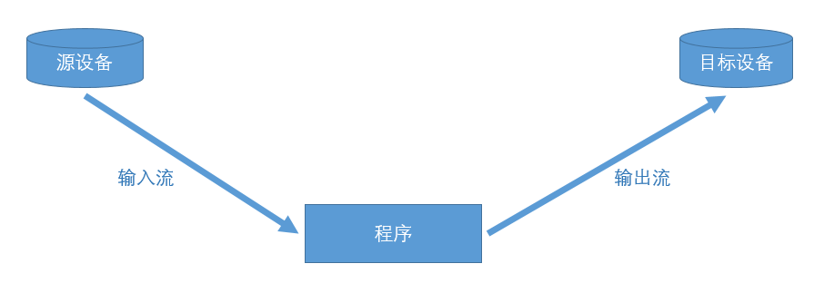

## IO流 -> Input/Output
> 背景：程序的运行需要数据，数据的获取需要和外部系统通信，外部系统复杂多变[文件、数据库、网络、IO设备、其它程序等] -> 操作系统'基于硬件封装'向上提供接口，程序语言'基于操作系统'向开发者提供接口，也就是程序语言进行抽象，屏蔽外部差异，基于功能提供不同的接口满足需求，从而更高效的编程 => 所有后端程序语言都会提供IO操作接口，因为后端必然需要处理数据

> 输入Input: 程序读取数据
> 1. 读取硬盘上的文件内容到程序：播放器打开视频文件、word打开文档
> 2. 读取网络数据：浏览器根据URL加载网站内容
> 3. 读取数据库：读取数据库系统的数据到程序
> 4. 读取硬件系统数据：车载电脑读取雷达扫描信息、温控系统等

> 输出Output: 程序写入数据到外部系统
> 1. 数据写入到硬盘：word文档的保存
> 2. 写入数据库：将数据库写入数据
> 3. 数据写入硬件系统：导弹系统将路径输出到飞控子系统

### IO流的程序语言视角
> 本质：程序语言会将上述IO流中的概念进行抽象，更适合编程理解

> 数据源：实际就是外部设备(提供数据) -> Data Source
> 源设备：为程序提供数据，对应输入流
> 目标设备：程序数据目的地，对应输出流

> 流：连续动态的数据集合[实际是抽象概念] -> Stream
> 输入流：数据源[源设备] -> 程序
> 输出流：程序 -> 数据源[目标设备]




### JAVA中的IO流
> 其提供了四大抽象类：字节处理[InputStream/OutputStream]、字符处理[Reader/Writer] -> 基于抽象类提供了很多实现类，开发者可根据不同功能要求、性能要求挑选合适的实现类
```java
/*
  抽象类及抽象方法：
    InputStream:
      int read();//读取一个字节的数据，返回int类型值(0~255，1个字节是8bit，2的8次方)，未读出字节则返回-1
      void close();//关闭输入流对象，释放相关系统资源
    OutputStream:
      void write(int n);//向目标数据源写入一个字节
      void close();//关闭输出流对象，释放相关系统资源

    Reader:
      int read();//读取一个字符的数据，返回int类型值(0~65535，字符的Unicode值)，未读出字符则返回-1
      void close();//关闭输入流对象，释放相关系统资源
    Writer:
      void write(int n);//向目标数据源学入一个字符
      void close();//关闭输出流对象，释放相关系统资源
*/
```

#### 补充概念
> 按流的方向分类
> 输入流：数据源[源设备] -> 程序，以InputStream、Reader结尾的流
> 输出流：程序 -> 数据源[目标设备]，以OutputStream、Writer结尾的流

> 按处理的数据单元分类
> 字节流：以字节为单位处理，以Stream结尾的流，FileInputStream/FileOutputStream
> 字符流：以字符为单位处理，以Reader/Writer结尾的流，FileReader/FileWriter

> 按处理对象不同分类
> 节点流：可直接从数据源或目的地读写数据，FileInputStream、FileReader、DataInputStream
> 处理流/包装流：处理流的流，通过对其它流的处理提高程序的性能，BufferedInputStream、BufferedReader
> -> 节点流处于IO操作的第一线，所有操作必须通过它们进行，处理流也可对节点流进行包装