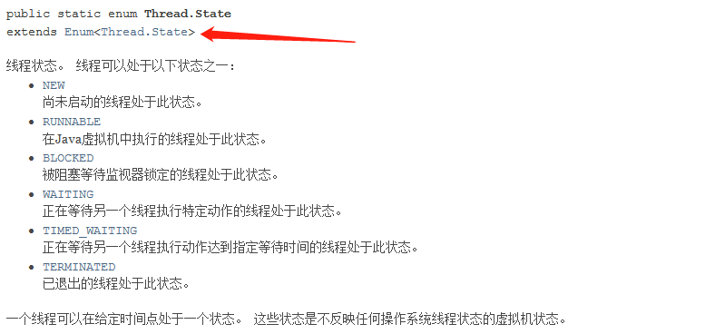

## 观测线程状态
> Thread.State


```java
package com.mi.threadstatus;

public class TestStateDemo {
  // 主线程
  public static void main(String[] args) throws InterruptedException {
    Thread thread = new Thread(() -> {
      for(int i=0; i<5; i++) {
        try {
          Thread.sleep(1000);
        } catch (InterruptedException e) {
          e.printStackTrace();
        }
      }
      System.out.println("------");
    });

    Thread.State state = thread.getState();
    System.out.println(state);// NEW

    thread.start();
    state = thread.getState();
    System.out.println(state);// RUNNABLE

    while(state != Thread.State.TERMINATED) {
      Thread.sleep(100);
      state = thread.getState();
      System.out.println(state);
    }
  }
}
```