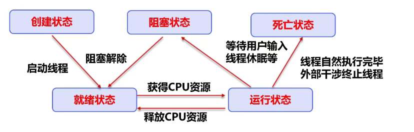
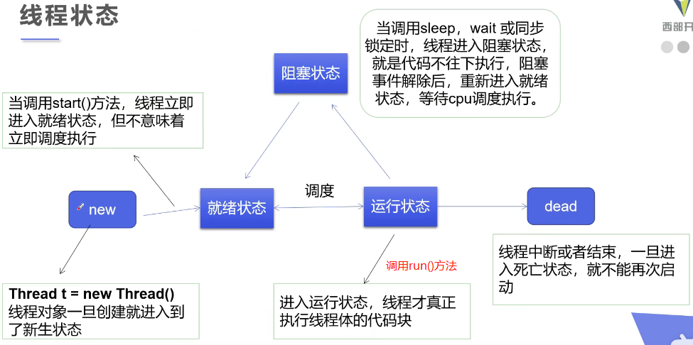

## 线程状态
> 创建、就绪、运行、阻塞、终止/死亡 -> 接口化调用实现



### 创建
> 创建线程类 -> 参考'线程实现'文件，其提供了三种实现方式

### 就绪
> 调用start()方法，并不意味着立即调度执行

### 运行
> 调用run()方法

### 阻塞
> 调用sleep(毫秒数)方法进行阻塞，时间到达后线程进入就绪状态
> 1.常用于模拟网络延时、倒计时等
> 2.sleep存在异常interruptedException
> 3.每个对象都有一个锁，sleep不会释放锁
> -> sleep()方法可放大'问题的发生性',暴露出线程同步问题[很重要]
```java
package com.mi.threadstatus;

import java.text.SimpleDateFormat;
import java.util.Date;

public class TestSleepDemo {
  // 模拟倒计时
  public static void CountDown() throws InterruptedException {
    int num = 10;
    while(true) {
      Thread.sleep(1000);
      System.out.println(num--);
      if(num <= 0) {
        break;
      }
    }
  }

  // 系统时间
  public static void systemTime() {
    Date startTime = new Date(System.currentTimeMillis());
    while(true) {
      try {
        Thread.sleep(1000);
        System.out.println(new SimpleDateFormat("HH:mm:ss").format(startTime));
        startTime = new Date(System.currentTimeMillis());
      } catch (InterruptedException e) {
        e.printStackTrace();
      }
    }
  }

  // main主线程
  public static void main(String[] args) {
    // try {
    //   TestSleepDemo.CountDown();
    // } catch (InterruptedException e) {
    //   e.printStackTrace();
    // }

    TestSleepDemo.systemTime();
  }
}
```

### 终止
> 不建议使用JDK提供的Stop()、destroy()方法，已废弃
> 建议使用'标志位'终止线程运行，或者线程停止下来
```java
package com.mi.threadstatus;

public class TestStopDemo implements Runnable{
  // 标志位
  private boolean flag = true;

  @Override
  public void run() {
    int i = 0;
    while(flag) {
      System.out.println("输出：" + i);
    }
  }

  // stop
  public void stop() {
    this.flag = false;
  }

  // main主线程
  public static void main(String[] args) {
    TestStopDemo testStopDemo = new TestStopDemo();
    new Thread(testStopDemo,"stop").start();

    for(int i = 0; i<=100000; i++) {
      if(i == 100000) {
        testStopDemo.stop();
        System.out.println("线程停止");
      }
    }
  }
}
```