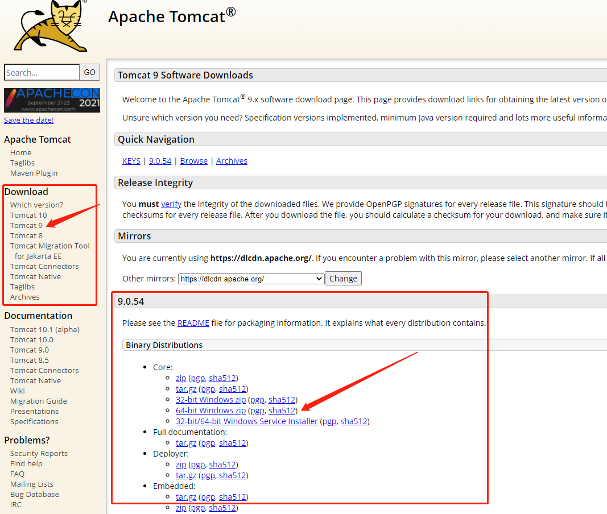
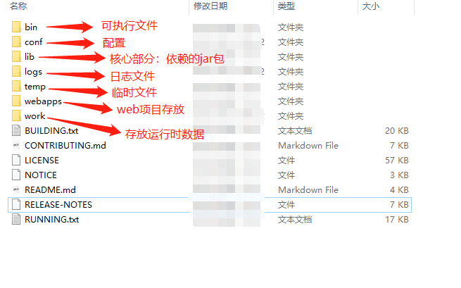
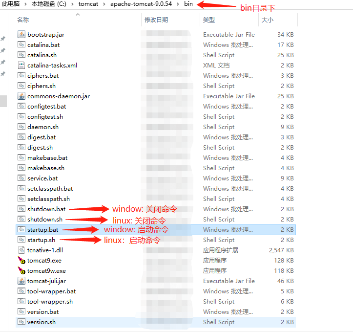
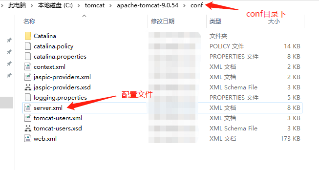
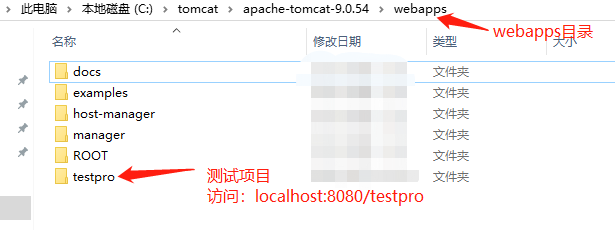

## tomcat -> 服务器

### 环境搭建
> 1. 官网下载解压缩即可：https://tomcat.apache.org

> 2. 目录结构

> 3. 启动/关闭
> 启动：双击'bin/startup.bat',之后会运行'命令行窗口'，其就是整个服务器运行情况
> 关闭：双击'bin/stutdown.bat' -> 或者直接关闭'命令行窗口'即可

> 4. web项目配置及存放位置
> 本质：请求打到服务器上获取资源 -> 需要配置请求地址、端口、资源存放位置[其提供默认配置，用户可灵活修改]

> 目录参考：
+ webapps                # tomcat设置的web目录
  - ROOT                 # localhost:8080默认读取的资源目录
  - testPro              # 自定义web项目名
    - WEB-INF            # 项目整体配置，此处可写java程序[完成动静分离，静态直接返回index.html，动态使用接口处理]
      - classes          # java程序
      - lib              # 依赖的jar包
      - web.xml          # 网站配置文件
    - index.html         # 默认首页 -> index.jsp或者其它tomcat支持的文件格式均可
    - static             # 静态资源
      - js
      - css
      - img
    - ....               # 其它