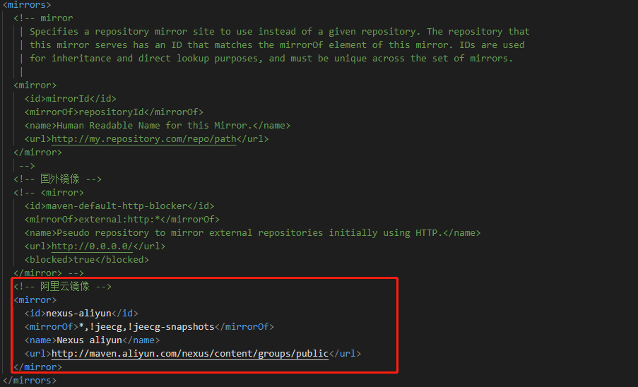

## Maven -> 项目管理工具
> 背景：项目开发需使用大量jar包，手动导入并配置较繁琐，这些均属于'工程层面问题'，开发者应专注业务开发 -> Maven更高效管理jar包

### 环境搭建
> 1. 官网下载解压缩即可：https://maven.apache.org/download.cgi


> 2. 目录结构


> 3. 配置环境变量
> [1].MAVEN_HOME: C:\maven\apache-maven-3.8.3  -> 根目录
> [2].M2_HOME: C:\maven\apache-maven-3.8.3\bin -> bin目录[建议添加此配置：springBoot、springCloud等框架均会使用M2_HOME环境变量]
> [3].path路径中添加%MAVEN_HOME%\bin -> %%表示引用外面的系统变量
> -> 本质：在任何目录下打开cmd运行maven相关操作，其首先会在当前目录下找maven相关的脚本文件，找不到就到系统变量设置的path路径下寻找，此处设置了bin目录，因此其就可以找到脚本文件 => 通过配置path环境变量实现了任何目录下均可使用maven

> 4. 查看是否安装成功
> [1].打开CMD命令行：win+R
> [2].输入mvn -version

> 5. 修改镜像 -> 国外镜像拉取很慢，使用国内阿里云镜像
> [1].找到配置文件: C:\maven\apache-maven-3.8.3\conf\setting.xml
> [2].修改配置文件中的mirrors部分

```xml
  <!-- 阿里云镜像 -->
  <mirror>
    <id>nexus-aliyun</id>
    <mirrorOf>*,!jeecg,!jeecg-snapshots</mirrorOf>
    <name>Nexus aliyun</name>
    <url>http://maven.aliyun.com/nexus/content/groups/public</url>
  </mirror>
```

> 6. 创建本地仓库
> [1].找到配置文件: C:\maven\apache-maven-3.8.3\conf\setting.xml
> [2].修改配置文件中的localRepository部分 -> 前提：根目录下创建maven-repo

```xml
  <!-- 修改仓库位置 -->
  <localRepository>C:\maven\apache-maven-3.8.3\maven-repo</localRepository>
```

### IDEA中使用Maven
> 1. 启动IDEA
> 2. 创建Maven项目[其提供很多项目模板，选择Javaweb模板]


> 3. IDEA配置Maven相关


### IDEA中配置tomcat
> 1. 启动IDEA
> 2. 创建Maven项目[其提供很多项目模板，选择Javaweb模板]


> 3. IDEA配置Maven相关
