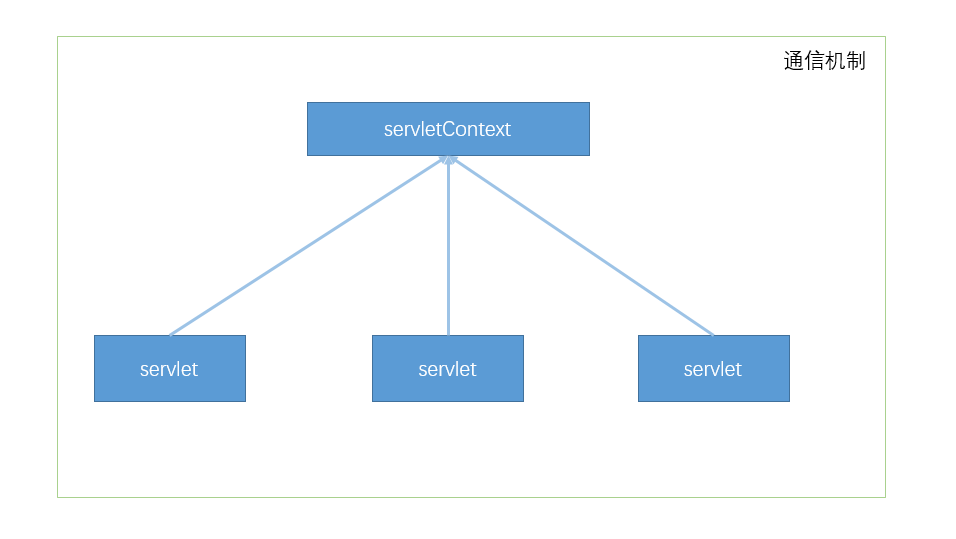

## servletContext -> servlet上下文对象
> web容器在启动时会为每个web程序创建一个对应的上下文对象，表示的就是当前web应用，其可做到不同servlet间的通信[因为同属于一个web容器]


```java
package com.tt.servlet;

public class HelloServlet extends HttpServlet {
  @Override
  protected void doGet(HttpServletRequest req, HttpServletResponse resp) throws ServletException, IOException {
    /*
      servletContext:
        -> web容器在启动时会为每个web程序创建一个对应的上下文对象，表示的就是当前web应用，其可做到不同servlet间的通信[因为同属于一个web容器]

        1.共享数据：各个servlet数据共享
          ServletContext context = this.getServletContext();
          context.setAttribute("username","xx");
          context.getAttribute("username");

        2.获取初始化参数：web.xml配置初始化参数 or 通过servletContext接口注入初始化参数
          String url = context.getInitParameter("url");

        3.请求转发：
          -> 请求转发的url不会改变[307状态码]，重定向会改变url[后端直接将请求url做了修改，302状态码]
          RequestDispatcher requestDispatcher = context.getRequestDispatcher("/share");//转发的请求路径
          requestDispatcher.forward(req,resp);//调用forward实现请求转发

        4.读取资源文件：
          -> 读取资源：1.new properties();  2.load(流)
          -> 资源文件目录：main/resources下创建资源，打包后的路径target/classes/xx.properties，classes目录也称之为classpath
          InputStream stream = context.getResourceAsStream("/WEB-INF/classes/db.properties");//路径：项目构建后的路径
          Properties prop = new Properties();
          prop.load(stream);
          String username = prop.getProperty("username");
          String password = prop.getProperty("password");
          resp.setContentType("text/html");
          resp.setCharacterEncoding("utf-8");
          resp.getWriter().print(username + ":" + password);
    */
    System.out.println("servlet调用成功");
    ServletContext context = this.getServletContext();
    String username = "共享value";
    context.setAttribute("username",username);
}

  @Override
  protected void doPost(HttpServletRequest req, HttpServletResponse resp) throws ServletException, IOException {
    doGet(req,resp);
  }
}
```