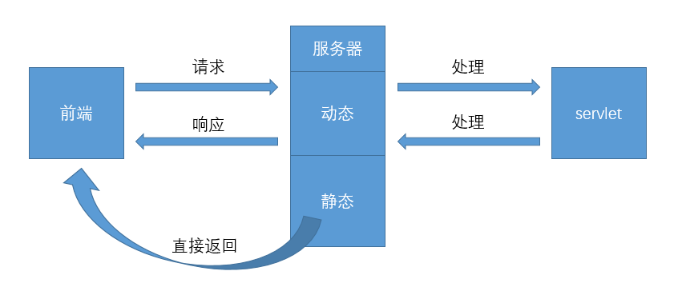

## servlet
> sun公司实现动态web的技术，也就是使用java程序处理网络请求进而操作数据
> 使用：sun提供了servlet接口，开发者编写类实现该接口，然后将该类部署到web服务器即可 -> sun官方提供了两个实现类[GenericServlet类实现了servlet接口，HttpServlet类继承了GenericServlet类],开发时直接继承这些类即可，更多聚焦在请求和响应


### 项目前期准备
> 基于Maven搭建父子项目：父项目中创建子模块，每个子模块都是单独的javaweb项目 -> 优点：maven是项目工程化的产物，擅长管理依赖包，父子项目中可将公共配置提取到父项目配置文件中，尤其是依赖管理配置

> 项目创建过程中，父子项目的核心配置文件pom.xml会自动做相应的改动，但由于idea版本的差异，部分版本下需要手动修改配置
```xml
<!-- 父项目的配置文件pom.xml -->
<?xml version="1.0" encoding="UTF-8"?>
<project xmlns="http://maven.apache.org/POM/4.0.0"
    xmlns:xsi="http://www.w3.org/2001/XMLSchema-instance"
    xsi:schemaLocation="http://maven.apache.org/POM/4.0.0 http://maven.apache.org/xsd/maven-4.0.0.xsd">
  <groupId>com.tt</groupId>
  <artifactId>javaweb-03-servlet</artifactId>
  <packaging>pom</packaging>
  <version>1.0-SNAPSHOT</version>
  <modelVersion>4.0.0</modelVersion>
  <!-- 子模块：此处需添加子模块的名字[artifactId] -->
  <modules>
    <module>servlet-01</module>
    <module>servlet-02</module>
    <module>response</module>
    <module>request</module>
  </modules>
    
  <!-- 项目依赖 -->
  <dependencies>
    <!-- https://mvnrepository.com/artifact/javax.servlet/javax.servlet-api -->
    <dependency>
      <groupId>javax.servlet</groupId>
      <artifactId>javax.servlet-api</artifactId>
      <version>4.0.1</version>
      <scope>provided</scope>
    </dependency>
    <!-- https://mvnrepository.com/artifact/javax.servlet.jsp/jsp-api -->
    <dependency>
      <groupId>javax.servlet.jsp</groupId>
      <artifactId>javax.servlet.jsp-api</artifactId>
      <version>2.3.3</version>
      <scope>provided</scope>
    </dependency>
  </dependencies>

  <build>
    <!-- 配置resources，防止资源导出失败 -->
    <resources>
      <resource>
        <directory>src/main/resources/</directory>
        <includes>
          <include>**/*.properties</include>
          <include>**/*.xml</include>
        </includes>
        <filtering>true</filtering>
      </resource>
      <resource>
        <directory>src/main/java</directory>
        <includes>
          <include>**/*.properties</include>
          <include>**/*.xml</include>
        </includes>
        <filtering>true</filtering>
      </resource>
    </resources>
  </build>
</project>

<!-- 子项目的配置文件pom.xml -->
<?xml version="1.0" encoding="UTF-8"?>
<project xmlns="http://maven.apache.org/POM/4.0.0" xmlns:xsi="http://www.w3.org/2001/XMLSchema-instance"
  xsi:schemaLocation="http://maven.apache.org/POM/4.0.0 http://maven.apache.org/xsd/maven-4.0.0.xsd">
  
  <!-- 添加parent标签：此处需添加父项目的GAV[groupId、artifactId、version] -->
  <parent>
    <groupId>com.tt</groupId>
    <artifactId>javaweb-03-servlet</artifactId>
    <version>1.0-SNAPSHOT</version>
  </parent>
  <!-- 子项目 -->
  <artifactId>servlet-01</artifactId>
  <!-- 打包方式 -->
  <packaging>war</packaging>
  <modelVersion>4.0.0</modelVersion>
</project>
```