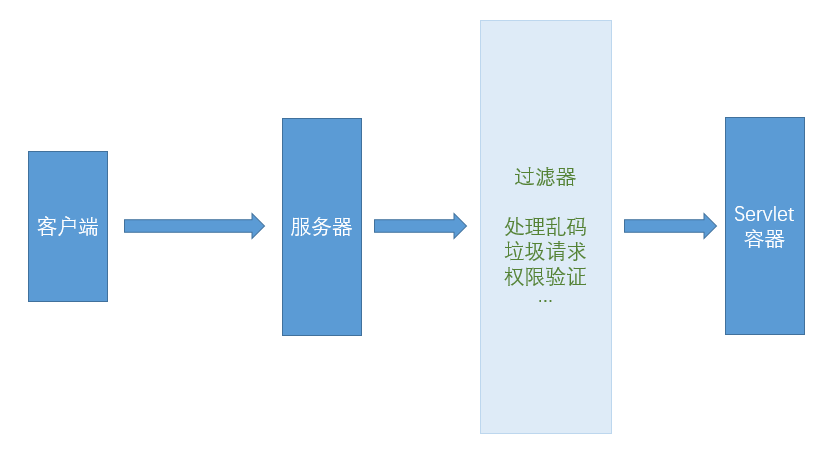

## filter -> 过滤器
> 背景：客户端 -> 服务器 -> servlet容器;//所有的请求都会打到servlet容器，每个servlet就需要写相同的代码，例如处理乱码、垃圾请求，权限验证等，filter会在网络请求打到servlet容器前添加过滤，实际就是将各个servlet公有代码提取出来即可


### 使用
> 1. web.xml中添加过滤器
```xml
<!-- 过滤器注册 -->
<filter>
  <filter-name>CharacterEncodingFilter</filter-name>
  <filter-class>com.tt.filter.CharacterEncodingFilter</filter-class>
</filter>
<!-- 映射 -->
<filter-mapping>
  <filter-name>CharacterEncodingFilter</filter-name>
  <!-- 只要是如下路径都要进行过滤 -->
  <url-pattern>/filter/*</url-pattern>
</filter-mapping>
```

> 2.过滤器类
```java
package com.tt.filter;
import javax.servlet.*;
import java.io.IOException;
/*
  过滤器使用：
    1.需实现Filter接口[javax.servlet.*,不要导错了]
    2.重写方法
      init();//初始化
      doFilter();//过滤函数
      destroy();//销毁
*/
public class CharacterEncodingFilter implements Filter {
  @Override
  public void init(FilterConfig filterConfig) throws ServletException {
    // 服务器启动时初始化 -> 通过filterConfig参数操作一些事项
    System.out.println("初始化");
  }

  @Override
  public void doFilter(ServletRequest servletRequest, ServletResponse servletResponse, FilterChain filterChain) throws IOException, ServletException {
    System.out.println("filter执行前");
    servletRequest.setCharacterEncoding("utf-8");
    servletResponse.setCharacterEncoding("utf-8");
    servletResponse.setContentType("text/html;charset=UTF-8");//指定服务器响应给浏览器的编码 && 浏览器会根据该值对接收到的数据进行编码(解码)
    // filterChain.doFilter(servletRequest,servletResponse); 请求继续往下走，不写默认拦截
    filterChain.doFilter(servletRequest,servletResponse);
    System.out.println("filter执行后");
  }

  @Override
  public void destroy() {
    // 服务器关闭时销毁
    System.out.println("销毁");
  }
}
```