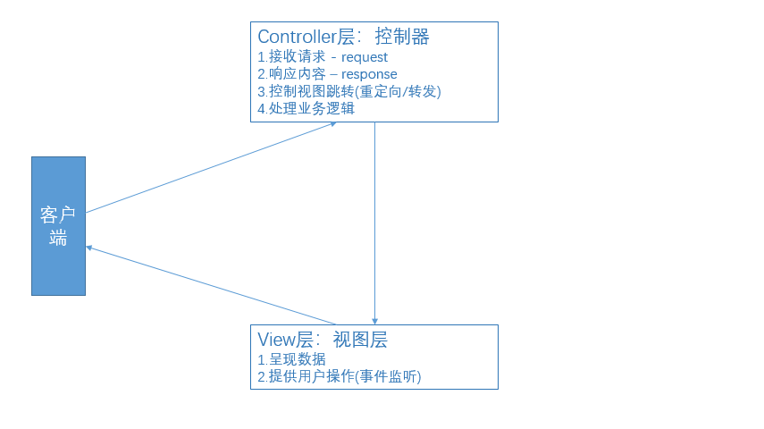
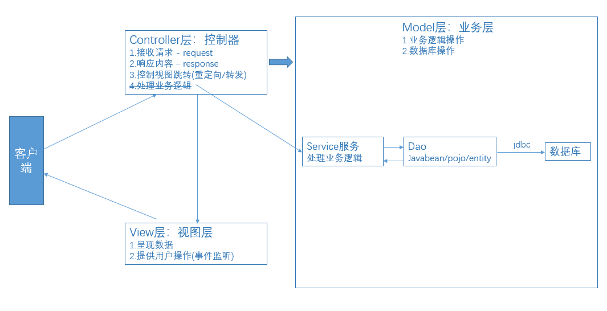

## MVC -> 架构模式
> 背景：最初并没有架构思想，servlet、jsp中随便写java代码，也没有侧重点，那时候需求也简单，后来企业级应用需求很多，为了扩展和维护性诞生了'VC'架构，servlet专注写java处理代码，jsp专注于呈现数据 && 提供用户操作[事件监听]，servlet就是Controller层，Controller层很重，后来逐渐将业务处理逻辑代码抽离出来，也就是'M'层，此时就形成了'MVC'架构 -> 架构领域：没有什么是不能通过添加一层解决的

