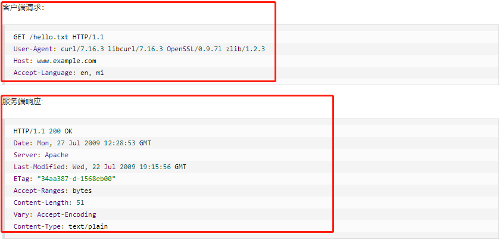

## javaweb
> java技术解决web互联网领域的技术栈，java在客户端提供了javaApplet，目前很少使用 -> 现在的javaWeb聚焦：java技术搭建'C/S'架构的后端服务[tomcat、servlet、jsp等]

### 计算机网络基础
> web的本质就是C/S架构模式，也就是客户端发送请求到服务器，底层就是通过'请求报文'经过7层网络协议到达服务器，服务器解析相关内容返回'响应报文'，也就是开发者仅关注应用层协议即可，常用的就是HTTP、HTTPS、Websocket等 -> 下述以HTTP为例

#### HTTP
> 报文：
> http是应用层协议，其将请求相关信息封装在请求报文中发送给服务器，服务器进行报文解析，返回响应报文

> 请求报文
> 请求行：请求方法、请求URL、协议类型及版本
> 请求头：元数据信息
> 请求体：数据主体

> 响应报文
> 响应行：协议类型及版本、状态码、状态码描述
> 响应头：源数据信息
> 响应体：数据主体

> 版本：
> HTTP/0.9: 仅支持GET、仅支持HTML格式的资源 -> 最初版本
> HTTP/1.0: 支持GET/POST/HEAD、支持多种数据格式[Content-type声明数据格式，格式参考就是MIMIE]、请求行必须添加协议类型及版本，请求头元数据类型也在增多, 单连接模式[每次TCP连接仅能发送一个请求，响应后立即关闭，每次都需要重新建立连接，TCP又是三次握手四次挥手，连接成本较高]
> HTTP/1.1: 新增请求方式PUT/PATCH/OPTION/DELETE、持久连接[每次TCP连接后允许多请求同时发送，并发性更高，客户端和服务端发现对方长时间没活动后，就可以主动关闭连接，规范做法是：客户端发最后请求时，发送Connection:close,通知服务器返回后关闭连接]、支持文件断点续传、支持更多的响应状态码
> HTTP/2.0: 双工模式[多路复用技术，客户端允许多请求同时发送，服务器也可同时处理多请求，效率更高]、服务器可主动推送数据
